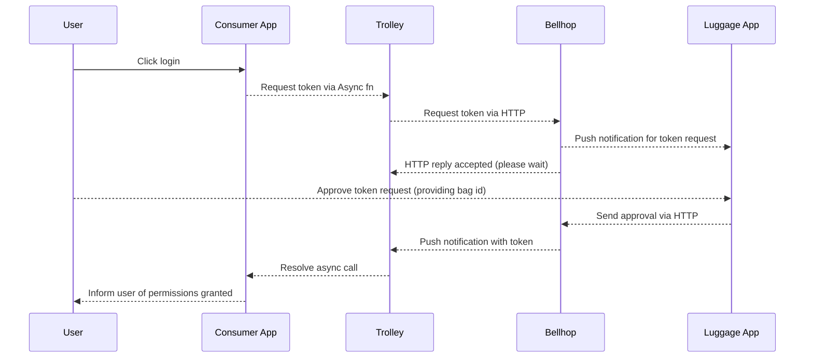

Components

- Trolley (Client side library)
- Bellhop (Server side API)
- Closet (Backend for storing cubes, including bellhop cubes)

Login Flow

```mermaid
sequenceDiagram
    User->>Consumer App: Click login
    Consumer App-->>Trolley: Request token via Async fn
    Trolley-->>Bellhop: Request token via HTTP
    Bellhop-->>Luggage App: Push notification for token request
    Bellhop-->>Trolley: HTTP reply accepted (please wait)
    User-->>Luggage App: Approve token request (providing bag id)
    Luggage App-->>Bellhop: Send approval via HTTP
    Bellhop-->>Trolley: Push notification with token
    Trolley-->>Consumer App: Resolve async call
    Consumer App-->>User: Inform user of permissions granted
```

New User Flow
